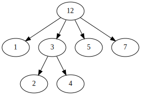

# Mon

Wrapper, TypeAlias, Maybe, Result, Tree, Lazy, Either and Combinators for Java.


[](
https://oss.sonatype.org/content/repositories/releases/net/kemitix/mon/)
[](
https://search.maven.org/artifact/net.kemitix/mon)

The documentation below is being slowly migrated to [Javadoc](https://kemitix.github.io/mon/).

- [Maven Usage](#Maven-Usage)
- [Wrapper](#Wrapper) - light-weight type-alias-like
- [TypeAlias](#TypeAlias) - type-alias-like monadic wrapper
- [Maybe](#Maybe) - Maybe, Just or Nothing
- [Result](https://kemitix.github.io/mon/net/kemitix/mon/result/package-summary.html) - Result, Success or Err
- [Tree](#Tree) - generic trees
- [Lazy](#Lazy) - lazy evaluation
- [Either](#Either) - Either, Left or Right
- [Combinators](#Combinators) - Before, After or Around

---
## Maven Usage

``` xml
<dependency>
    <groupId>net.kemitix</groupId>
    <artifactId>mon</artifactId>
    <version>${mon.version}</version>
</dependency>
```

---
## Wrapper

A simple `@FunctionalInterface` that contains a value. Can be used to implement
a form of type-alias in Java.

In Haskell, it is possible to create an alias for a Type, and to then use
that alias with the same behaviour as the original, except that the compiler
doesn't treat the alias as the same Type and will generate compiler errors
if you try to use them together. e.g.:

``` haskell
newtype PhoneNumber = PhoneNumber String
newtype Name = Name String
newtype PhoneBookEntry = PhoneBookEntry (Name, PhoneNumber)
newtype PhoneBook = PhoneBook [PhoneBookEntry]
```

In Java, we don't have the ability to have that true alias, so `Wrapper` simply
wraps the value within a new type. It's as close as I could get to a Haskell
type alias in Java.

The benefits of using `Wrapper` in this way are:

- encapsulation of the wrapped type when passing references through code
  that doesn't need to access the actual value, but only to pass it on
- type-safe parameters where you would otherwise be passing generic `String`s,
  `Integer`s, `List`s, or other general classes
- less verbose than implementing your own

### Example

``` java
interface PhoneNumber extends Wrapper<String> {}

PhoneNumber pn = () -> "01234 567890";
String v = pn.value();
```

### Instance Methods

#### `T value()`

Returns the value in the `Wrapper`.

### Skip the Mon import

If the only thing you want is `Wrapper`, you can skip importing the `mon`
dependency by declaring your types like so:

``` java
interface PhoneNumber {String value();}
```

This is functionally identical to the example above using `Wrapper`.

---
## TypeAlias

This was a precursor to `Wrapper` and should be considered deprecated. It is
also a form of wrapper, but is also a Monadic wrapper, unlike `Wrapper`.

### Example

``` java
class PhoneNumber extends TypeAlias<String> {
    private PhoneNumber(final String value) {
        super(value);
    }
    public static PhoneNumber of(final String phoneNumber) {
        return new PhoneNumber(phoneNumber);
    }
}

PhoneNumber pn = PhoneNumber.of("01234 567890");
String v = pn.getValue();
```

### Instance Methods

#### `final <R> R map(final Function<T, R> f)`

Map the `TypeAlias` into another value.

``` java
StudentId studentId = StudentId.of(123);
String idString = studentId.map(id -> String.valueOf(id));

class StudentId extends TypeAlias<Integer> {
    private StudentId(Integer value) {
        super(value);
    }
    static StudentId of(Integer id) {
        return new StudentId(id);
    }
}
```
---
#### `final <R, U extends TypeAlias<R>> U flatMap(final Function<T, U> f)`

Map the `TypeAlias` into another `TypeAlias`.

``` java
StudentId studentId = StudentId.of(123);
StudentName studentName = studentId.flatMap(id -> getStudentName(id));

class StudentName extends TypeAlias<String> {
    private StudentName(String value) {
        super(value);
    }
    static StudentName of(final String name) {
        return new StudentName(name);
    }
}
```
---
#### `T getValue()`

Get the value of the `TypeAlias`.

``` java
String name = studentName.getValue();
```
---
## Maybe

Allows specifying that a value may or may not be present. Similar to
`Optional`. `Maybe` provides additional methods that `Optional` doesn't (as of
Java 8): `isNothing()`, `stream()`, `ifNothing()` and `match()`. `Maybe` does 
not have a `get()` method.

`Maybe` is a Monad.

Unlike `Optional`, when a `map()` results in a `null`, the `Maybe` will
continue to be a `Just` (i.e. have a value - that value is `null`). `Optional` 
would switch to being empty.

### Example

``` java
import net.kemitix.mon.maybe.Maybe;

import java.util.function.Function;
import java.util.function.Predicate;

class MaybeExample {

    public static void main(String[] args) {
        Maybe.just(countArgs(args))
             .filter(isEven())
             .map(validMessage())
             .match(
                 just -> System.out.println(just),
                 () -> System.out.println("Not an valid value")
             );
    }

    private static Function<Integer, String> validMessage() {
        return v -> String.format("Value %d is even", v);
    }

    private static Predicate<Integer> isEven() {
        return v -> v % 2 == 0;
    }

    private static Integer countArgs(String[] args) {
        return args.length;
    }
}
```

In the above example, the number of command line arguments are counted, if
there are an even number of them then a message is created and printed by
the `Consumer` parameter in the `match` call. If there is an odd number of
arguments, then the filter will return `Maybe.nothing()`, meaning that the
`nothing` drops straight through the `map` and triggers the `Runnable` parameter
in the `match` call.

### Static Constructors

#### `static <T> Maybe<T> maybe(T value)`

Create a Maybe for the value that may or may not be present.

Where the value is `null`, that is taken as not being present.

``` java
Maybe<Integer> just = Maybe.maybe(1);
Maybe<Integer> nothing = Maybe.maybe(null);
```
---
#### `static <T> Maybe<T> just(T value)`

Create a `Maybe` for the value that is present.

The `value` must not be `null` or a `NullPointerException` will be thrown.

``` java
Maybe<Integer> just = Maybe.just(1);
```
---
#### `static <T> Maybe<T> nothing()`

Create a `Maybe` for a lack of a value.

``` java
Maybe<Integer> nothing = Maybe.nothing();
```
---
#### `static <T> Maybe<T> findFirst(Stream<T> stream)`

Creates a `Maybe` from the first item in the stream, or nothing if the stream 
is empty.

``` java
Maybe<Integer> just3   = Maybe.findFirst(Stream.of(3, 4, 2, 4));
Maybe<Integer> nothing = Maybe.findFirst(Stream.empty());
```
---
### Instance Methods

#### `Maybe<T> filter(Predicate<T> predicate)`

Filter a Maybe by the predicate, replacing with Nothing when it fails.

``` java
Maybe<Integer> maybe = Maybe.maybe(getValue())
                            .filter(v -> v % 2 == 0);
```
---
#### `<R> Maybe<R> map(Function<T,R> f)`

Applies the function to the value within the `Maybe`, returning the result 
within another `Maybe`.

``` java
Maybe<Integer> maybe = Maybe.maybe(getValue())
                            .map(v -> v * 100);
```
---
#### `<R> Maybe<R> flatMap(Function<T,Maybe<R>> f)`

Applies the function to the value within the `Maybe`, resulting in another 
`Maybe`, then flattens the resulting `Maybe<Maybe<T>>` into `Maybe<T>`.

``` java
Maybe<Integer> maybe = Maybe.maybe(getValue())
                            .flatMap(v -> Maybe.maybe(getValueFor(v)));
```
---
#### `void match(Consumer<T> just, Runnable nothing)`

Matches the `Maybe`, either to `just` or `nothing`, and performs either the
`Consumer`, for a `Just` value, or the `Runnable` for a `Nothing` value.

``` java
Maybe.maybe(getValue())
     .match(
         just -> workWithValue(just),
           () -> nothingToWorkWith()
     );
```
---
#### `<R> R matchValue(Function<T, R> justMatcher, Supplier<R> nothingMatcher)`

Matches the `Maybe`, either `Just` or `Nothing`, and performs either the
`Function`, for a `Just` value, or the `Supplier` for a `Nothing` value, 
returning the result.

``` java
String value = Maybe.maybe(getValue())
                    .matchValue(
                                just -> Integer.toString(just),
                                  () -> "nothing"
                    );
```
---
#### `T orElse(T otherValue)`

A value to use when the `Maybe` is `Nothing`.

``` java
Integer value = Maybe.maybe(getValue())
                     .orElse(1);
```
---
#### `T orElseGet(Supplier<T> otherValueSupplier)`

Provide a value to use when the `Maybe` is `Nothing`.

``` java
Integer value = Maybe.maybe(getValue())
                     .orElseGet(() -> getDefaultValue());
```
---
#### `T or(Supplier<Maybe<T> alternative)`

Provide an alternative `Maybe` to use when the `Maybe` is `Nothing`.

``` java
Maybe<Integer> value = Maybe.maybe(getValue())
                            .or(() -> Maybe.just(defaultValue));
```
---
#### `void orElseThrow(Supplier<Exception> error)`

Throw the exception if the `Maybe` is `Nothing`.

``` java
Integer value = Maybe.maybe(getValue())
                     .orElseThrow(() -> new RuntimeException("error"));
```
---
#### `Maybe<T> peek(Consumer<T> consumer)`

Provide the value within the `Maybe`, if it exists, to the `Consumer`, and
returns the original `Maybe`.

``` java
Maybe<Integer> maybe = Maybe.maybe(getValue())
                            .peek(v -> v.foo());
```
#### `void ifNothing(Runnable runnable)`

Run the `Runnable` if the `Maybe` is `Nothing`, otherwise do nothing.

``` java
Maybe.maybe(getValue())
     .ifNothing(() -> doSomething());
```
---
#### `Stream<T> stream()`

Converts the `Maybe` into either a single value stream or an empty stream.

``` java
Stream<Integer> stream = Maybe.maybe(getValue())
                              .stream();
```
---
#### `boolean isJust()`

Checks if the `Maybe` is a `Just`.

``` java
boolean isJust = Maybe.maybe(getValue())
                      .isJust();
```
---
#### `boolean isNothing()`

Checks if the `Maybe` is `Nothing`.

``` java
boolean isNothing = Maybe.maybe(getValue())
                         .isNothing();
```
---
#### `Optional<T> toOptional()`

Convert the `Maybe` to an `Optional`.

``` java
Optional<Integer> optional = Maybe.maybe(getValue())
                                  .toOptional();
```
---

## Tree

A Generalised tree, where each node may or may not have an item, and may have
any number of sub-trees. Leaf nodes are Trees with zero sub-trees.

### Static Constructors

#### `static <R> Tree<R> leaf(R item)`

Create a leaf containing the item. The leaf has no sub-trees.

``` java
Tree<String> tree = Tree.leaf("item");
```
---
#### `static<R> Tree<R> of(R item, Collection<Tree<R>> subtrees)`

Create a tree containing the item and sub-trees.

``` java
Tree<String> tree = Tree.of("item", Collections.singletonList(Tree.leaf("leaf"));
```
---
#### `static <B> TreeBuilder<B> builder(final Class<B> type)`

Create a new `TreeBuilder` starting with an empty tree.

``` java
TreeBuilder<Integer> builder = Tree.builder(Integer.class);
```
---
#### `static <B> TreeBuilder<B> builder(final Tree<B> tree)`

Create a new `TreeBuilder` for the given tree.

``` java
Tree<Integer> tree = ...;
TreeBuilder<Integer> builder = Tree.builder(tree);
```
---
### Instance Methods

#### `<R> Tree<R> map(Function<T, R> f)`

Applies the function to the item within the `Tree` and to all sub-trees,
returning a new `Tree`.

``` java
Tree<UUID> tree = ...;
Tree<String> result = tree.map(UUID::toString);
```
---
#### `Maybe<T> item()`

Returns the contents of the `Tree` node within a `Maybe`.

``` java
Tree<Item> tree = ...;
Maybe<Item> result = tree.item();
```
---
#### `int count()`

Returns the total number of items in the `Tree`, including sub-trees. `Null`
items don't count.

``` java
Tree<Item> tree = ...;
int result = tree.count();
```
---
#### `List<Tree<T> subTrees()`

Returns a list of sub-trees within the `Tree`.

``` java
Tree<Item> tree = ...;
List<Tree<Item>> result = tree.subTrees();
```
---
## TreeBuilder

A mutable builder for a `Tree`. Each `TreeBuilder` allows modification of a
single `Tree` node. You can use the `select(childItem)` method to get a
`TreeBuilder` for the subtree that has the given child item.

### Example

``` java
TreeBuilder<Integer> builder = Tree.builder();
builder.set(12).addChildren(Arrays.asList(1, 3, 5, 7));
TreeBuilder<Integer> builderFor3 = builder.select(3);
builderFor3.addChildren(Arrays.asList(2, 4));
Tree<Integer> tree = builder.build();
```

Will produce a `Tree` like:


---
### Static Constructors

None. The `TreeBuilder` is instantiated by `Tree.builder()`.

### Instance Methods

#### `Tree<T> build()`

Create the immutable Tree.

``` java
TreeBuilder<Integer> builder = Tree.builder();
Tree<Integer> tree = builder.build();
```
---
#### `TreeBuilder<T> item(T item)`

Set the current `Tree`'s item and return the `TreeBuilder`.

#### `TreeBuilder<T> add(Tree<T> subtree)`

Adds the subtree to the current tree.

#### `TreeBuilder<T> addChild(T childItem)`

Add the Child item as a sub-Tree.

#### `TreeBuilder<T> addChildren(List<T> children)`

Add all the child items as subTrees.

#### `Maybe<TreeBuilder<T>> select(T childItem)`

Create a `TreeBuilder` for the subTree of the current `Tree` that has the
childItem.

## Lazy

A lazily evaluated expression. Using a `Supplier` to provide the value, only
evaluates the value when required, and never more than once.

### Static Constructors

#### `static <R> Lazy<R> of(Supplier<R> supplier)`

Create a new `Lazy` value from the `Supplier`.

``` java
Suppler<UUID> supplier = ...;
Lazy<UUID> lazy = Lazy.of(supplier);
```

### Instance Methods

#### `boolean isEvaluated()`

Checks if the value has been evaluated.

``` java
Lazy<UUID> lazy = ...;
boolean isEvaluated = lazy.isEvaluated();
```
---
#### `T value()`

The value, evaluating it if necessary.

``` java
Lazy<UUID> lazy = ...;
UUID value = lazy.value();
```
---
#### `<R> Lazy<R> map(Function<T, R> f)`

Maps the `Lazy` instance into a new `Lazy` instance using the `Function`.

``` java
Lazy<UUID> uuidLazy = ...;
Lazy<String> stringLazy = uuidLazy.map(v -> v.toString());
```
---
## Either

Allows handling a value that can be one of two types, a left value/type, or a
right value/type.

`Either` *is not* a Monad.

When an `Either` is returned from a method it will contain either a left or a
right.

Where the `Either` is used to represent success/failure, the left case is, by
convention, used to indicate the error, and right the success. An alternative
is to use the `Result` which more clearly distinguishes success from failure.

---
### Static Constructors

#### `static <L, R> Either<L, R> left(final L l)`

Create a new `Either` holding a left value.

``` java
Either<Integer, String> left = Either.left(getIntegerValue());
```
---
#### `static <L, R> Either<L, R> right(final R r)`

Create a new `Either` holding a right value.

``` java
Either<Integer, String> right = Either.right(getStringValue());
```
---
### Instance Methods

#### `boolean isLeft()`

Checks if the `Either` holds a left value.

``` java
Either<Integer, String> either = Either.left(getIntegerValue());
boolean leftIsLeft = either.isLeft();
boolean rightIsLeft = either.isLeft();
```
---
#### `boolean isRight()`

Checks if the `Either` holds a right value.

``` java
Either<Integer, String> either = Either.left(getIntegerValue());
boolean leftIsRight = either.isRight();
boolean rightIsRight = either.isRight();
```
---
#### `void match(Consumer<L> onLeft, Consumer<R> onRight)`

Matches the `Either`, invoking the correct `Consumer`.

``` java
Either<Integer, String> either = Either.left(getIntegerValue());
either.match(
    left -> handleIntegerValue(left),
    right -> handleStringValue(right)
);
```
---
#### `<T> Either<T, R> mapLeft(Function<L, T> f)`

Map the `Function` across the left value.

``` java
Either<Integer, String> either = Either.left(getIntegerValue());
Either<Double, String> either = either.mapLeft(i -> i.doubleValue());
```
---
#### `<T> Either<L, T> mapRight(Function<R, T> f)`

Map the function across the right value.

``` java
Either<Integer, String> either = Either.left(getIntegerValue());
Either<Integer, String> either = either.mapRight(s -> s + "x");
```
---
#### `<T> Either<T, R> flatMapLeft(Function<L, Either<T, R>> f)`

FlatMap the function across the left value.

``` java
Either<Integer, String> either = Either.left(2);
Either<Integer, String> resultLeft = either.flatMapLeft(l -> Either.left(l * 2));
Either<Integer, String> resultRight = either.flatMapLeft(l -> Either.right(l * 2));
```
---
#### `<T> Either<T, R> flatMapRight(Function<L, Either<T, R>> f)`

FlatMap the function across the right value.

``` java
Either<Integer, String> either = Either.right("2");
Either<Integer, String> resultLeft = either.flatMapRight(l -> Either.left(l * 2));
Either<Integer, String> resultRight = either.flatMapRight(l -> Either.right(l * 2));
```
---
#### `Optional<L> getLeft()`

Returns an `Optional` containing the left value, if is a left, otherwise returns
an empty `Optional`.

``` java
Either<Integer, String> either = Either.right("2");
Optional<Integer> left = either.getLeft();
```
---
#### `Optional<R> getRight()`

Returns an `Optional` containing the right value, if is a right, otherwise 
returns an empty `Optional`.

``` java
Either<Integer, String> either = Either.right("2");
Optional<String> right = either.getRight();
```

## Combinators

Taken from [The Bounds of Java Newsletter #3](https://github.com/boundsofjava/boj-newsletter-003/tree/master/src/main/java/com/boundsofjava/newsletter/introducingcombinators), although the associated article isn't online anymore.

### After

Attach a `BiConsumer` to a `Function`, so that when the `Function` is called, 
the `BiConsumer` is called afterwards, receiving the original argument to the
`Function` plus the result.

#### Example

``` java
BiConsumer<BigDecimal, String> after =
    (amount, result) ->
        System.out.println("Amount was " + amount + ", Result is " + result);

var tax = BigDecimal.valueOf("1.22");
Function<BigDecimal, String> addTax =
    amount -> "$" + amount.multiply(tax);

Function<BigDecimal, String> addTaxDecorated =
        After.decorate(addTax, after);

var amount = BigDecimal.valueOf("1000");
String result = addTaxDecorated.apply(amount);
```
---
#### `static <T, R> Function<T, R> After.decorate(Function<T, R> function, BiConsumer<T, R> after)`

Creates a new decorated `Function`.

---
### Before

Attach a `Consumer` to a `Function`, so that when the `Function` is called,
the `Consumer` is called first, receiving the argument to the `Function`.

#### Example

``` java
Consumer<BigDecimal> before =
    amount -> System.out.println("Amount is " + amount);

var tax = BigDecimal.valueOf("1.22");
Function<BigDecimal, String> addTax =
    amount -> "$" + amount.multiply(tax);
    
Function<BigDecimal, String> addTaxDecorated =
    Before.decorate(before, addTax);

var amount = BigDecimal.valueOf("1000");
String result = addTaxDecorated.apply(amount);
```

#### `static <T, R> Function<T, R> decorate(Consumer<T> before, Function<T, R> function)`

Creates a new decorated `Function`.

### Around

Attach a `BiConsumer` to a `Function`, so that when the `Function` is called,
the `BiConsumer` is called with an `Around.Executable` that will invoke the `Function`.
The `BiConsumer` is responsible for calling `execute()` on the `Around.Executable` in
order to invoke the `Function`.
The `BiConsumer` can perform actions before and after calling `execute()` on the 
`Around.Executable`. 

#### Example

``` java
BiConsumer<Around.Executable<String>, BigDecimal> around =
    (function, amount) -> {
        System.out.println("Amount is " + amount);
        var result = function.execute(); // INVOKE THE FUNCTION
        System.out.println("Result is " + result");
    };

var tax = BigDecimal.valueOf("1.22");
Function<BigDecimal, String> addTax =
    amount -> "$" + amount.multiply(tax);
    
Function<BigDecimal, String> addTaxDecorated =
    Around.decorate(addTax, around);

var amount = BigDecimal.valueOf("1000");
String result = addTaxDecorated.apply(amount);
```

#### `static <T, R> Function<T, R> decorate(final Function<T, R> function, final BiConsumer<Executable<R>, T> around)`

Creates a new decorated `Function`.
